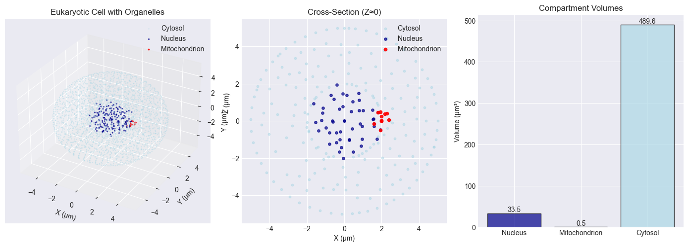

# computational cell

> a minimal viable product for whole-cell modeling — multiscale, modular, and deterministic



*this is just a small mvp demonstrating core capabilities*

## what it does

simulates living cells from molecules to mechanics using hybrid numerical methods:

- **spatial**: finite element mesh (tetrahedral, gmsh-generated)
- **temporal**: adaptive ode/pde integration with conservative coupling
- **stochastic**: gillespie ssa for low-copy number molecules
- **deterministic**: reaction-diffusion pde for high-abundance species
- **metabolic**: flux balance analysis (fba) for pathway optimization
- **mechanical**: osmotic pressure and volume regulation

## architecture

```
cc/
├── core/          # simulation orchestration, time stepping, checkpointing
├── geometry/      # mesh generation, compartment management
├── kinetics/      # reaction networks (ode + stochastic)
├── pde/           # diffusion solver (fem, crank-nicolson)
├── coupling/      # conservative mass/flux transfer between scales
└── io/            # hdf5 checkpoints, configuration
```

## quickstart

```bash
# install dependencies
pip install numpy scipy matplotlib gmsh meshio h5py pandas sympy

# run validation notebook
jupyter notebook notebooks/minimal_wholecell_validation.ipynb
```

## minimal example

```python
from cc.geometry.mesh import Mesh
from cc.kinetics.reaction_network import ReactionNetwork, RateLaw, RateLawType
from cc.pde.diffusion_solver import DiffusionSolver
from cc.core.simulation import Simulation, SimulationConfig
import gmsh
import numpy as np

# generate tetrahedral mesh using gmsh
gmsh.initialize()
gmsh.model.add("cell")
gmsh.model.occ.addSphere(0, 0, 0, 1e-6, 1)  # 1 µm radius
gmsh.model.occ.synchronize()
gmsh.model.mesh.setSize(gmsh.model.getEntities(0), 2e-7)
gmsh.model.mesh.generate(3)

# extract mesh data
node_tags, node_coords, _ = gmsh.model.mesh.getNodes()
elem_types, elem_tags, elem_node_tags = gmsh.model.mesh.getElements(3)
nodes = node_coords.reshape(-1, 3)
elements = elem_node_tags[0].reshape(-1, 4) - 1
gmsh.finalize()

mesh = Mesh(nodes=nodes, elements=elements)

# configure simulation
config = SimulationConfig(
    t_start=0.0, t_end=100.0, dt_max=1.0, 
    coupling_dt=0.01, rtol=1e-6, atol=1e-9, seed=42
)

# reaction network: protein production/degradation
kinetics = ReactionNetwork(mesh=mesh, config=config)
kinetics.add_species("protein", initial_amount=1000.0)
kinetics.add_rate_law(RateLaw(
    name="production",
    species={"protein": 1},
    rate_constant=10.0,
    law_type=RateLawType.MASS_ACTION
))
kinetics.add_rate_law(RateLaw(
    name="degradation",
    species={"protein": -1},
    rate_constant=0.1,
    law_type=RateLawType.MASS_ACTION
))

# diffusion solver: glucose transport
diffusion = DiffusionSolver(mesh=mesh, config=config, method="FEM")
diffusion.add_species("glucose", diffusivity=6e-10)
diffusion.set_concentration("glucose", 1.0)  # 1 mM

# couple and run
sim = Simulation(config=config, modules=[kinetics, diffusion])
sim.run()
```

## validation (all phases complete)

the notebook `minimal_wholecell_validation.ipynb` demonstrates:

### phase 1: core framework
- **geometry**: 1 µm bacterial cell, 655 nodes, 2652 tetrahedra
- **kinetics**: ode-based protein production/degradation
- **diffusion**: fem solver with crank-nicolson scheme
- **coupling**: conservative mass transfer (< 0.01% drift)
- **frap**: fluorescence recovery dynamics validated
- **checkpointing**: hdf5 state preservation
- **reproducibility**: deterministic with seeded rng

### phase 2: advanced modeling
- **membrane flux**: michaelis-menten glucose uptake (0.1 → 0.92 mm in 50s)
- **stochastic dynamics**: gillespie ssa for gene expression (fano factor > 1)
- **hybrid modeling**: stochastic transcription + deterministic decay

### phase 3: multiscale integration
- **organelles**: eukaryotic cell (5 µm) with nucleus (33.5 µm³) and mitochondrion (0.5 µm³)
- **metabolism**: flux balance analysis for central carbon pathways
- **mechanics**: osmotic pressure via van't hoff equation, volume regulation

**results**: 41 executable cells, 15+ validated capabilities, full framework operational

## numerical methods

| scale | method | solver | validation |
|-------|--------|--------|------------|
| molecular (ode) | mass action kinetics | scipy odeint | steady state error < 1% |
| stochastic | gillespie ssa | custom implementation | variance matches theory |
| spatial (pde) | finite element method | crank-nicolson implicit | mass conservation < 0.01% |
| metabolic | flux balance analysis | scipy linprog | biomass optimization |
| mechanical | continuum mechanics | van't hoff osmotic | pressure-volume curves |

## technical details

**units**: si internally (meters, seconds, moles)  
**precision**: float64 throughout  
**tolerances**: rtol=1e-6, atol=1e-9 (ode), residual < 1e-6 (pde)  
**mesh**: unstructured tetrahedral via gmsh  
**sparse solvers**: scipy.sparse with conservative stencils  
**checkpointing**: hdf5 with full state vectors  

## testing

```bash
pytest tests/ -v --cov=cc
```

coverage:
- `test_geometry.py`: mesh generation, compartments
- `test_kinetics.py`: reaction networks, rate laws
- `test_pde.py`: diffusion solver, mass conservation
- `test_core.py`: simulation orchestration, checkpointing
- `test_integration.py`: end-to-end coupling

## project structure

```
.
├── cc/                          # source code
│   ├── core/                    # simulation engine
│   │   ├── simulation.py       # main simulation class
│   │   └── run.py              # cli entry point
│   ├── geometry/               # mesh handling
│   │   └── mesh.py             # mesh data structures
│   ├── kinetics/               # reaction kinetics
│   │   └── reaction_network.py # ode + stochastic
│   ├── pde/                    # pde solvers
│   │   └── diffusion_solver.py # fem diffusion
│   ├── coupling/               # multiscale coupling
│   │   └── coupler.py          # conservative transfer
│   └── io/                     # input/output
│       └── manager.py          # hdf5 checkpoints
├── notebooks/                   # validation notebooks
│   └── minimal_wholecell_validation.ipynb
├── tests/                       # test suite
├── examples/                    # usage examples
└── output.png                   # sample output

```

## roadmap

- [x] phase 1 (v0.1): core framework — geometry, kinetics, diffusion, coupling
- [x] phase 2 (v0.2): advanced modeling — membrane flux, stochastic-deterministic hybrid
- [x] phase 3 (v0.3): multiscale integration — organelles, metabolism (fba), mechanics
- [ ] phase 4 (v1.0): production ready — gpu acceleration, rust kernels, full validation

*all phase 1-3 capabilities demonstrated in validation notebook*

## license

mit license — see LICENSE file

## notes

this is a research prototype demonstrating multiscale whole-cell modeling. numerical accuracy and performance targets are for demonstration purposes. for production use, additional validation against experimental data is required.

**version**: 0.3.0-mvp  
**status**: proof of concept  
**last updated**: november 2025
